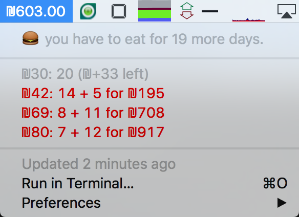

# 10bisbar



A [bitbar](https://getbitbar.com) plugin that helps you quit your
[10Bis](10bis.co.il) guesswork and never get stuck with an empty (or overly
full) account.

The menu in the picture means: you have 19 more days of ordering to do (working days). Then:

* For a meal costing 30NIS, you can buy 20 meals for the current balance (603NIS)
* For a meal costing 42NIS, you can buy 14 meals for the current balance (603NIS), and 5 more meals for additional 195NIS which will probably be charged on your credit card.
* You get the point... Of course, all of that is configurable.

## Quick Start

Install [bitbar](https://getbitbar.com) and configure a plugin directory if you
never did. Download a 10bisbar binary from the [releases](https://github.com/jondot/10bisbar/releases) section and extract it to
your bitbar plugins folder, then continue to the configuration section.


Or, if you prefer to build on your own and produce a binary. You'll need Go and
UPX (`brew install upx`). Then, run:

`$ make dist`

After that's done, point bitbar to this folder, or simply copy the resulting
`10bisbar` binary to your plugins folder. There are no dependencies so you
should be good to go immediately.

### Configuration

Place a file called `.10bis.json` at your home folder, so that it will be found in `~/.10bis.json`.

For file's the content, start with this sample:

```json
{
  "username":"your-10bis-user",
  "password":"your-10bis-password",
  "prices":[30, 42, 69, 80],
  "sunday_to_thursday_working_days": true
}
```   
note that if ```sunday_to_thursday_working_days : false ``` this will get enable by default ```monday_to_friday_working_days : true ```   

Put your username and password in, and then put your favorite meal price options in `prices`. Finally,
indicate how many days per week you don't use 10bis at all (typically weekends).


Refresh your bitbar, and you're good to go.

# Contributing
Fork, implement, add tests, pull request, get my everlasting thanks and a respectable place here :).


# Copyright

Copyright (c) 2016 [Dotan Nahum](http://gplus.to/dotan) [@jondot](http://twitter.com/jondot). See MIT-LICENSE for further details.


